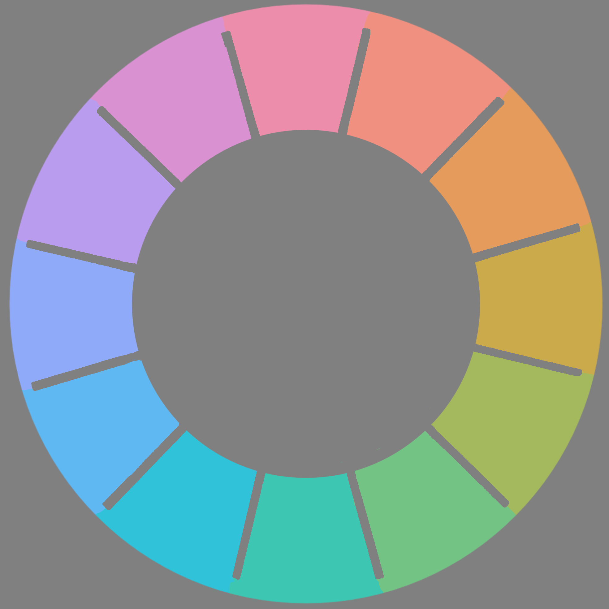

I made this visually accurate colour wheel using the [OKLCH colour picker](https://oklch.com). All colour are of the same lightness and chroma and their hues are evenly distributed. Since traditional colour wheels are made using pure paint, which has the highest saturation, I want to use the highest chroma possible. Chroma = 0.12 is the value that doesn't have gaps in hues in the sRGB colour gamut. The lightness has to be between 71-76. I chose lightness = 75.

