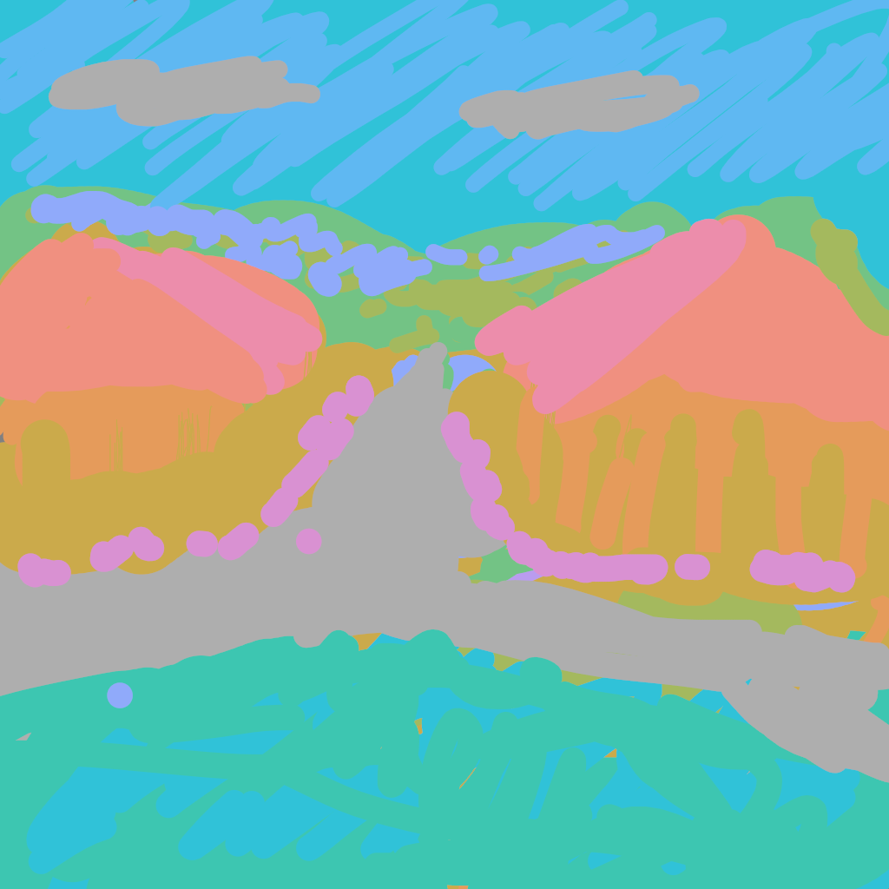
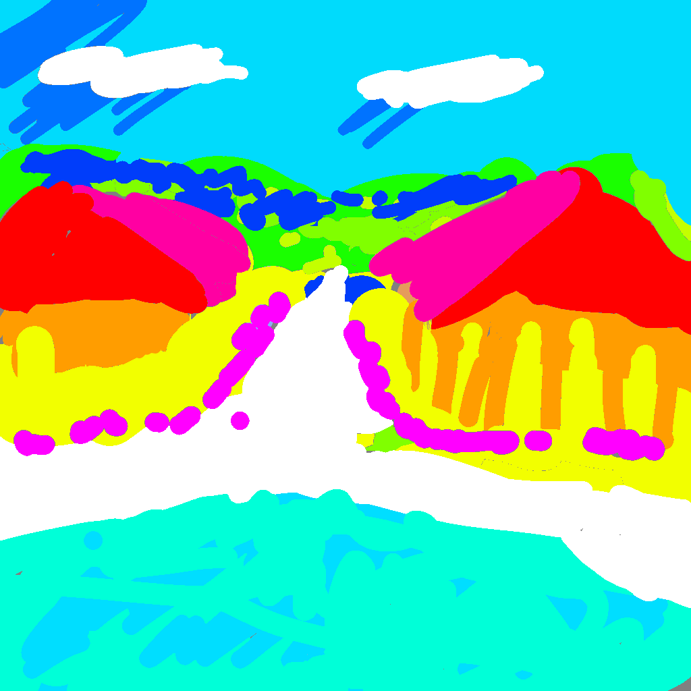
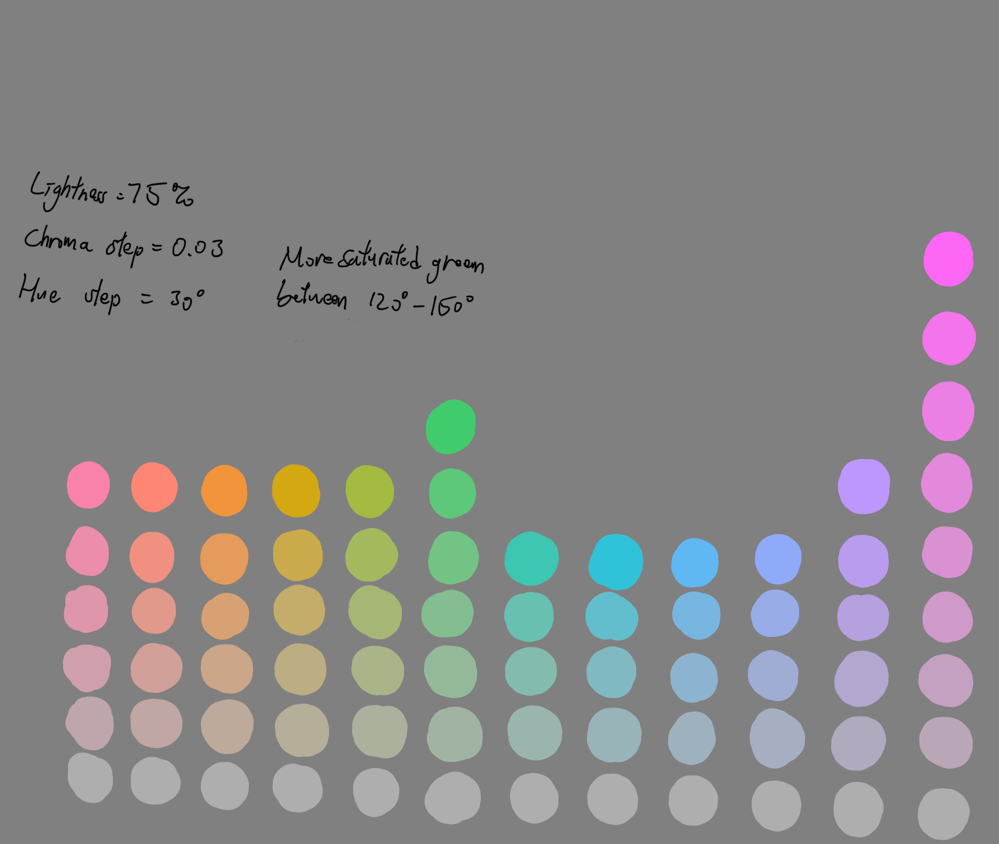

I made this visually accurate colour wheel using the [OKLCH colour picker](https://oklch.com). All colour are of the same lightness and chroma and their hues are evenly distributed. Since traditional colour wheels are made using pure paint, which has the highest saturation, I want to use the highest chroma possible. Chroma = 0.12 is the value that doesn't have gaps in hues in the sRGB colour gamut. The lightness has to be between 71-76. I chose lightness = 75.

2024/05/25

This drawing doesn't have contrast. There's no difference in luminance and saturation so it looks weird and uncomfortable.

Now let me repaint it using the saturated colors. This looks like it was draw using the preset colours of MS Paint. So how come it looks more pleasant than the above one?

Even thought the preset colours all have 100 as values, they varies in luminance and saturation. Actually, the values are relative and cannot be used for comparsion among colours. This misleads artists.

Oklch colour space does a great job dealing with this problem. I think using it as the base of a traditional colour wheel would be helpful so I made one myself. I also made a discrete version of the colour space. This is one of the six charts.

The developers of Krita cares about colour spaces, so I hope someone would eventually integrate this colour picker in the tools.

