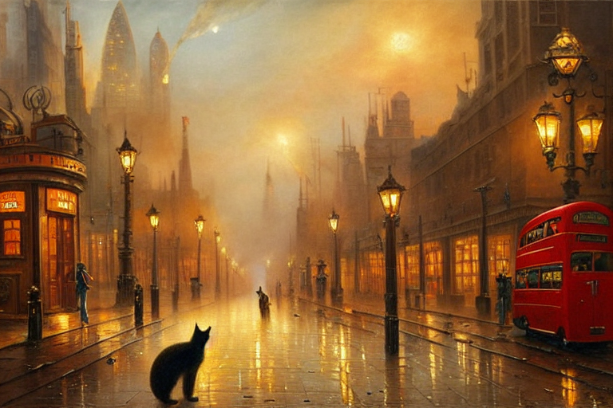

+++
title = 'AI Generated Oil Painting'
date = 2023-12-02T10:32:58+08:00
image = "london-cat.png"
categories = "gallery"
+++
這可是拿過獎的！

- Prompt: a highly detailed oil painting of a cat walking in foggy london street, steampunk, gears, steam engine, by leonardo da Vinci, trending in artstation

- Negative prompt: monochrome, blurry, jpeg artifacts, worst quality, watermark
- Steps: 30
- Sampler: DPM++ 2M Karras
- CFG scale: 10
- Seed: 189248350
- Size: 768x512
- Model hash: cc6cb27103
- Model: v1-5-pruned-emaonly 

