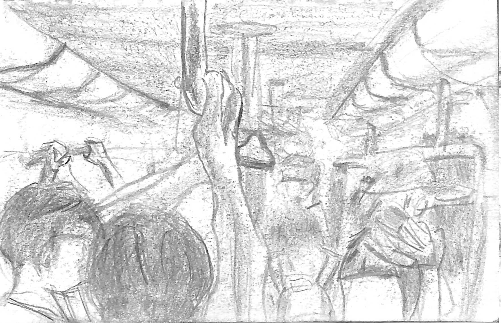

地鐵上，大家的握手機姿勢各種各樣：單手小指頂着機底，拇指滑屏幕；左手手掌捧着機背，右手食指滑屏幕；雙手在機背交疊，兩隻拇指在屏幕上快速敲擊；還有雙手抓着橫置的手機兩側，兩隻拇指在屏幕上劃圈。加上我的觀察角度也變來變去，有時是瞄旁邊的座位，有時是抬頭看坐在我正對面的人，或是側着身子抓把手的人。居然有種「橫看成嶺側成峯」的感覺。

這個時候，我作為列車上唯一一個不想看手機的人，該做什麼才能消除盯着玻璃窗做白日夢的煩悶呢？就是把這些形態各異的手掌全部描在紙上，做一本手掌合輯。

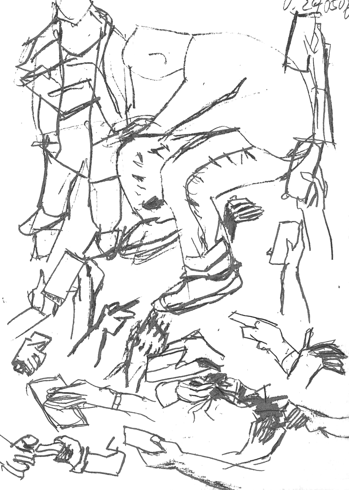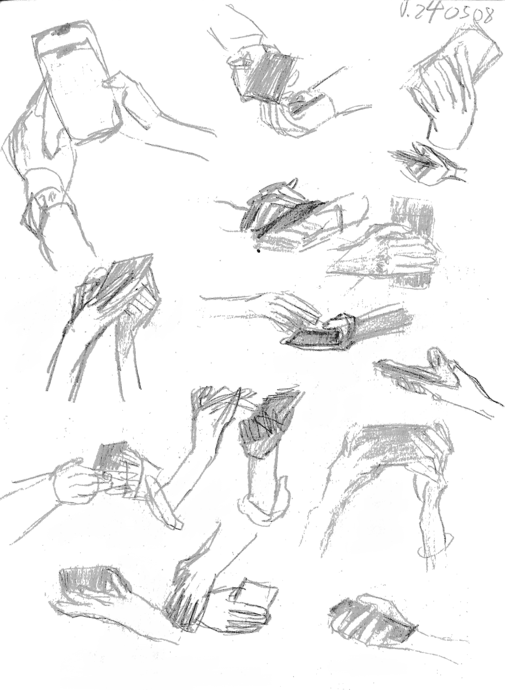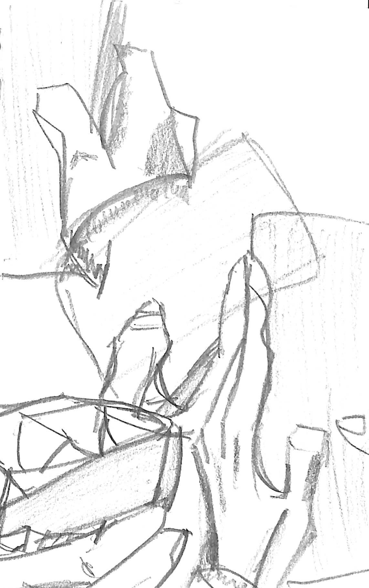

要盯着陌生人看肯定是不自在的。所以我會使用一些技巧。豎起本子，不能讓別人看見自己的畫紙；挑選離自己很遠的目標；不要一邊盯着人看一邊畫，要記住影像才在紙上動筆等等。不過這些技巧其實都不重要，最大的功臣還是手機。雖然我不太樂見，但正正是因為大家都無暇顧及手機之外的事物，我才有可乘之機。

手掌合輯畫膩了，就改畫球鞋合輯，再接着畫髮型合輯。「列車上有數不清的模特兒站着不動讓我畫，真是個理想的畫室！」但他們隨便翻一下手掌，轉一下頭，我就只能傻傻地盯着紙上的半成品了。沒什麼好抱怨的，畢竟世界的一切景象本來就是稍縱即逝的。不僅落筆要快，萬一目標下車了，就要找另外一個姿勢相似的目標拼接起來。

就這樣，我練就了一項無人能及的功夫：筆走龍蛇如入無人之境；目所能及之處，皆是素材。

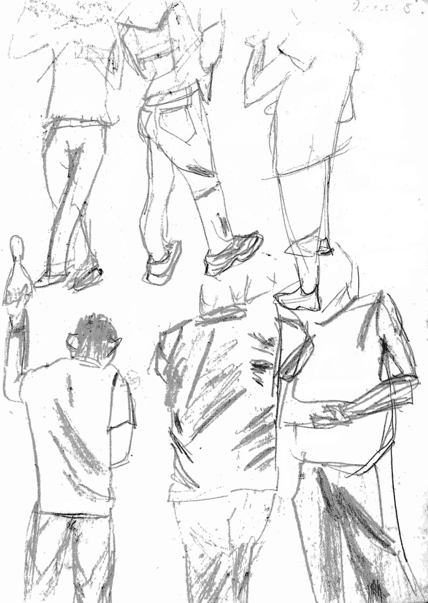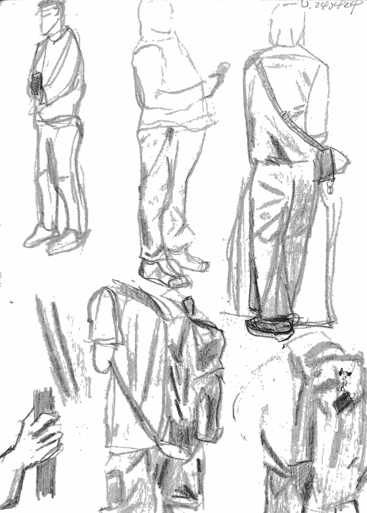

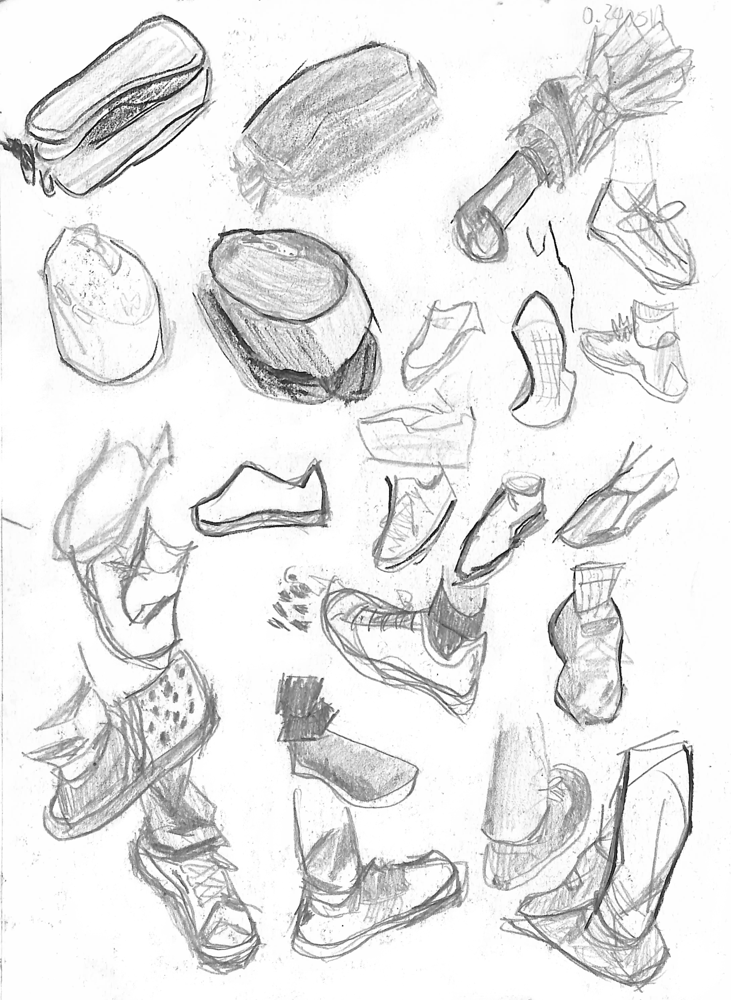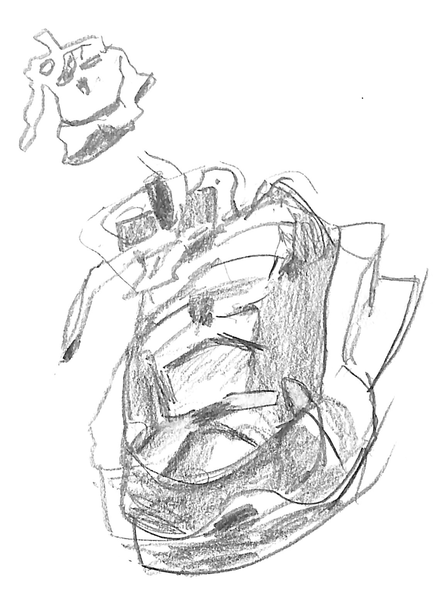

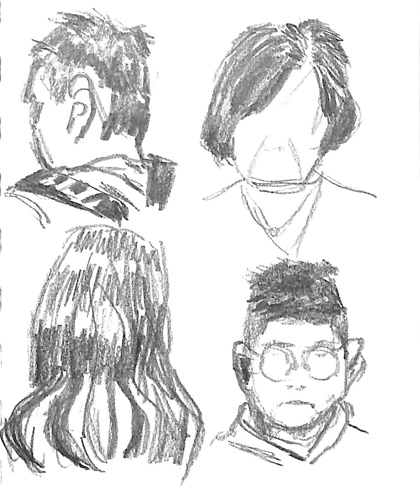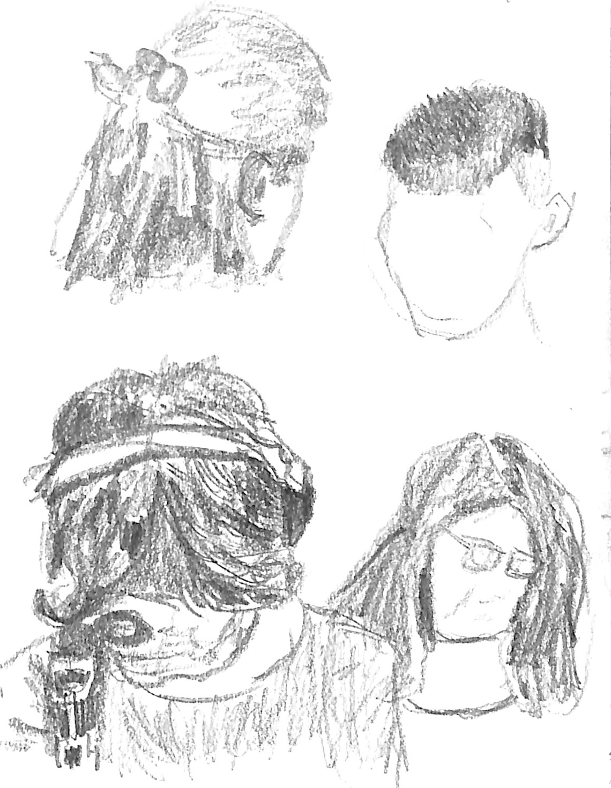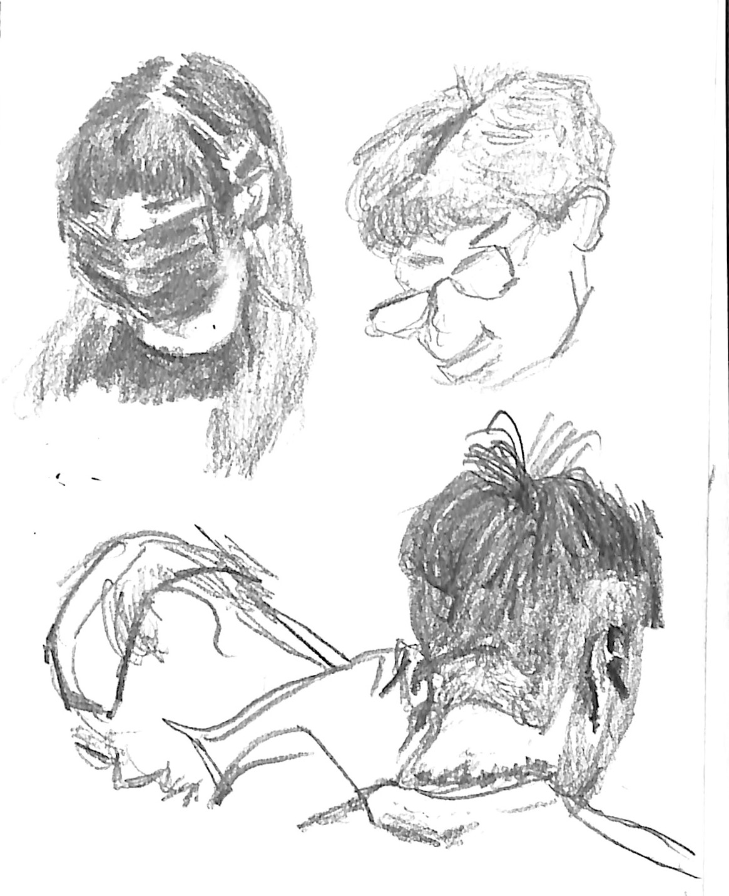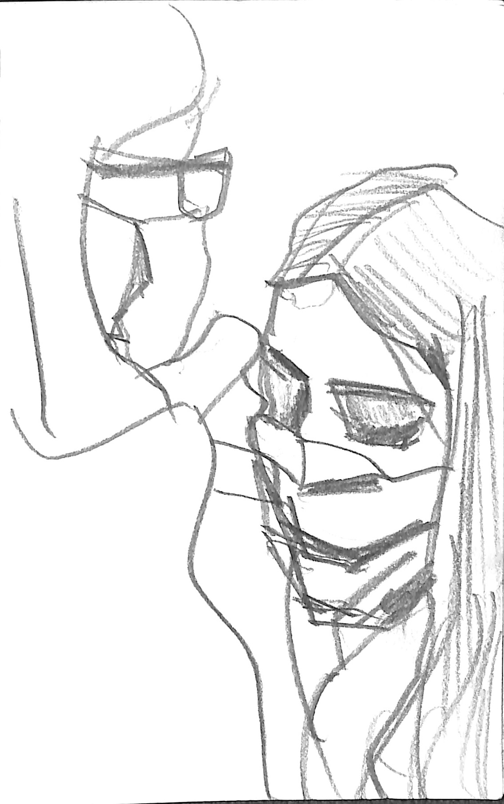

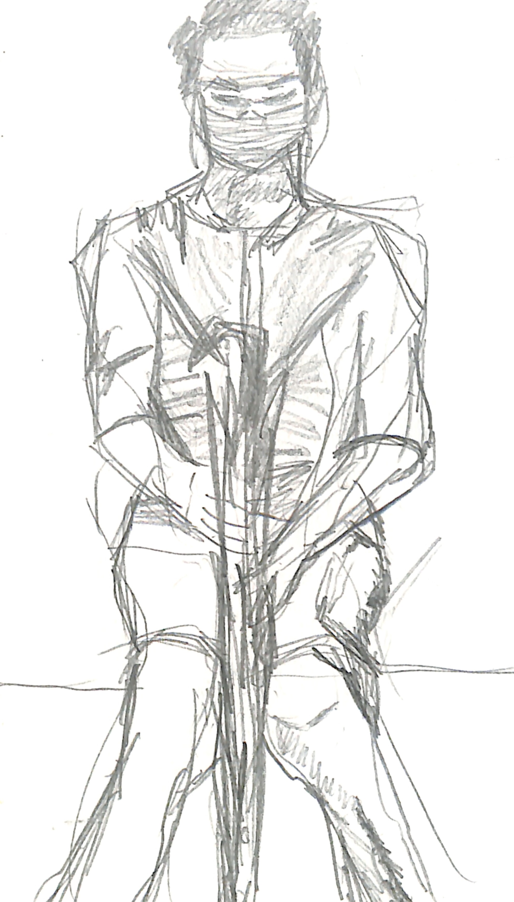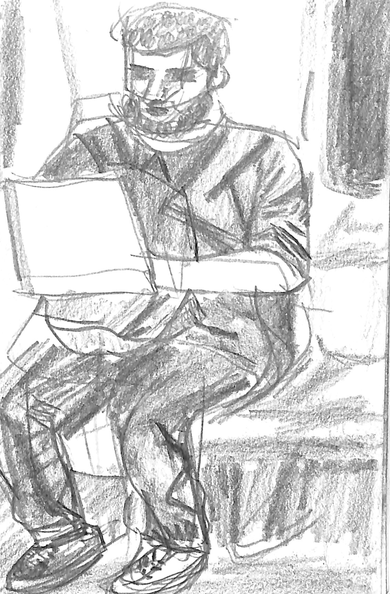

